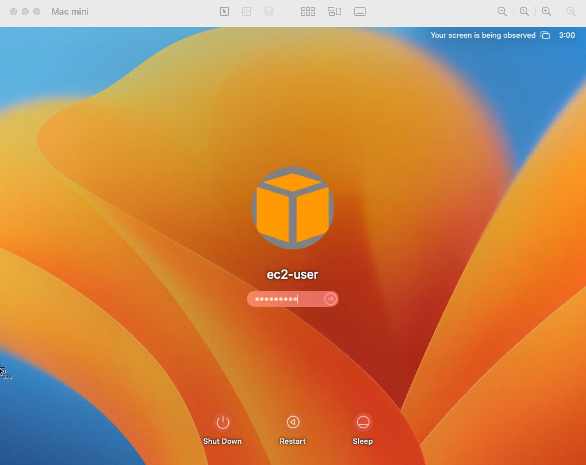

# Mac Lab

## Overview

To be completed soon.

## Remote Access

### SSH

Grab the output from ```terraform output``` which should show your EC2 Mac instance's public DNS.  The SSH key is already created and in your local directory as ```ssh_key.pem```.  Can others access my Mac?  See the **Important Firewall and White listing** for more information.  The output should look like this:

```
SSH Access - Mac 1
----------
ssh -i ssh_key.pem ec2-user@ec2-3-17-144-231.us-east-2.compute.amazonaws.com
```

Type those command and you're in.
```
% ssh -i ssh_key.pem ec2-user@ec2-3-17-144-231.us-east-2.compute.amazonaws.com
Last login: Sat Dec  2 15:01:00 2023

    ┌───┬──┐   __|  __|_  )
    │ ╷╭╯╷ │   _|  (     /
    │  └╮  │  ___|\___|___|
    │ ╰─┼╯ │  Amazon EC2
    └───┴──┘  macOS Ventura 13.6.1
```

### GUI Connection:  VNC or Apple Remote Desktop (ARN)

These instructions below were adapted from Amazon's docs because the default ports they listed resulted in an issue for me.

Reference:  https://docs.aws.amazon.com/AWSEC2/latest/UserGuide/ec2-mac-instances.html#mac-instance-vnc

1. You need a VNC or ARD client.  If you're connecting from a Mac you can use the built-in screen sharing application.

2. SSH into your Mac and setup the ec2-user password (will be automated soon through bootstrap script)
```
sudo passwd ec2-user
```

3.  Install and start MacOS screen sharing:
```
sudo launchctl enable system/com.apple.screensharing
sudo launchctl load -w /System/Library/LaunchDaemons/com.apple.screensharing.plist
```

4.  Disconnect from the SSH session by typing ```exit```

5.  From your computer, type the following command, replacing the ```instance-public-dns-fqdn```.  This will set up port forwarding over SSH.  The -L will set up a local port of 22590 which will be forwarded over SSH to your remote Mac instance listening on port 5900.  Ensure that you stay connected for the duration of the remote desktop connectedion needed. 

```
sudo ssh -L 22590:localhost:5900 -i ssh_key.pem ec2-user@instance-public-dns-fqdn
```

6. From your local computer, use the ARD client or VNC client that supports ARD to connect to localhost:22590. For example, use the Screen Sharing application on macOS as follows:
- Open Finder and select Go.
- Select Connect to Server.
- In the Server Address field, enter vnc://localhost:22590

You should now see this screen and can enter the credentials for your ec2-user.




## Requirements and Setup

Tested with:
* Mac OS 13.4
* terraform 1.5.7

Clone this repository:
```
git clone https://github.com/iknowjason/MacLab
```

Credentials Setup:

Generate an IAM programmatic access key that has permissions to build resources in your AWS account.  Setup your .env to load these environment variables.  You can also use the direnv tool to hook into your shell and populate the .envrc.  Should look something like this in your .env or .envrc:

```
export AWS_ACCESS_KEY_ID="VALUE"
export AWS_SECRET_ACCESS_KEY="VALUE"
```

## Build and Destroy Resources

### Run terraform init
Change into the AutomatedEmulation working directory and type:

```
terraform init
```

### Run terraform plan or apply
```
terraform apply -auto-approve
```
or
```
terraform plan -out=run.plan
terraform apply run.plan
```

### Destroy resources
```
terraform destroy -auto-approve
```

### View terraform created resources
The lab has been created with important terraform outputs showing services, endpoints, IP addresses, and credentials.  To view them:
```
terraform output
```

## Features and Capabilities

### Important Firewall and White Listing
Inbound SSH access to your Mac should only be allowed sourced from your public IPv4 address.  By default when you run terraform apply, your public IPv4 address is determined via a query to ifconfig.so and the ```terraform.tfstate``` is updated automatically.  If your location changes, simply run ```terraform apply``` to update the security groups with your new public IPv4 address.  If ifconfig.me returns a public IPv6 address,  your terraform will break.  In that case you'll have to customize the white list.  To change the white list for custom rules, update this variable in ```sg.tf```:
```
locals {
  src_ip = "${chomp(data.http.firewall_allowed.response_body)}/32"
  #src_ip = "0.0.0.0/0"
}
```

### Mac Examples for Building Intel, M1, M2, M2Pro


